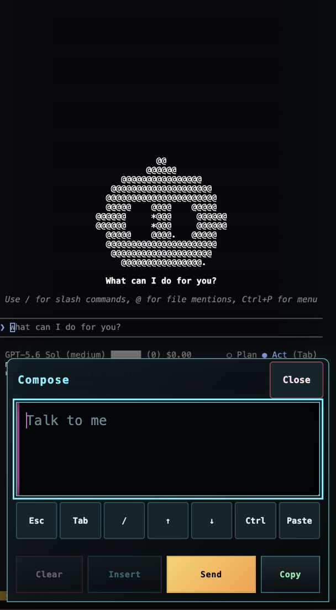

<p align="center">
  
</p>

<h1 align="center">driftty</h1>

<p align="center">
  A mobile-first web terminal and an installable gateway for reaching your
  shells from anywhere.
</p>

driftty turns a command-line session into a terminal that works comfortably in
a phone browser. It builds on [ttyd](https://github.com/tsl0922/ttyd) and adds
the controls, viewport behavior, and connection handling that terminal work on
a small touchscreen needs.

<p align="center">
  
  
  
</p>

**Goals:**

- One mobile terminal experience, no matter how driftty is run. The gateway
  image inherits the exact client from the mobile terminal image, so direct
  containers and gateway routes present the same touchscreen-optimized UI.
- Terminal work from anywhere, toward long-lived remote shells. The gateway
  reaches multiple SSH hosts and persistent tmux sessions through one web entry
  point, and terminal routes keep stable public URLs across reconnects.
- A lightweight footprint. Run it as a single container around any command, or
  add the gateway layer when you need SSH routing.

## Quick start: try the coding CLI demo

The quickest way to see driftty is the demo image. It opens a persistent tmux
session with three tabs so you can compare coding agents and test terminal
scrolling from a phone browser immediately:

```bash
docker run --rm \
  -p 127.0.0.1:7117:7117 \
  ghcr.io/mdp/driftty-demo:edge
```

Open <http://localhost:7117>. If either agent exits, its pane continues as a
Bash shell. The session starts with these tabs:

- `Cline`: the [Cline](https://cline.bot) terminal coding agent.
- `OpenCode`: the [OpenCode](https://opencode.ai) terminal coding agent.
- `Readme`: the project README printed into the terminal for testing scrollback
  and mobile drag scrolling.

Cline and OpenCode may each ask for provider or account configuration the first
time they run. Refreshing or reconnecting attaches to the same
`driftty-demo` tmux session and does not create another set of tabs.

To let OpenCode work on the current directory, mount it as the demo workspace:

```bash
docker run --rm \
  -p 127.0.0.1:7117:7117 \
  -v "$PWD:/workspace" \
  ghcr.io/mdp/driftty-demo:edge
```

The demo endpoint has no authentication. Keep the published port bound to
`127.0.0.1` and do not expose it to an untrusted network.

## Quick start: local tmux

On a Linux host, make sure your user has a running tmux server, build the
gateway, and mount that server's socket:

```bash
tmux has-session 2>/dev/null || tmux new-session -d -s main
docker build --target gateway -t driftty-gateway:local .

docker run --rm --name driftty-local \
  -p 127.0.0.1:7681:7681 \
  -v "/tmp/tmux-$(id -u):/run/host-tmux:ro" \
  driftty-gateway:local \
  --local-tmux /run/host-tmux/default
```

The foreground log prints a generated master password. Open
<http://localhost:7681>, sign in, and choose any tmux session. The **+** button
creates a host session named `driftty-<name>`. Commands and new shells run as
the host user through the host tmux server; only the tmux client runs in Docker.

At least one tmux session must remain alive to keep the default server and
socket running. For detached gateway operation, add
`-d --restart unless-stopped` and retrieve the generated password with
`docker logs driftty-local`.

This needs a Linux host using tmux's default
`/tmp/tmux-$(id -u)/default` socket, or an equivalent explicit source mount.
macOS Docker Desktop cannot expose its host tmux socket this way. Socket access
is effectively host-user shell access, so keep the loopback port binding unless
you put the gateway on a trusted network. Publishing with `-p 7681:7681`
listens on all interfaces and is plaintext HTTP until a TLS tunnel or reverse
proxy protects it.

Local tmux and SSH profiles can be used independently or together:

- Local only: use the command above; no profile file or SSH keys are needed.
- SSH only: use the normal Compose/configuration flow below without
  `--local-tmux`.
- Both: run the configured gateway with its usual `/config`, `/keys`, and
  known-hosts mounts, add the tmux socket mount, and append
  `--local-tmux /run/host-tmux/default` to its command.

When `--local-tmux` is present, the gateway adds the built-in **Local tmux**
entry to any readable `profiles.yaml`. If that file is absent, it starts in
local-only mode. The configured profile slug `local` is reserved when both
modes are enabled.

## Installation: install the SSH gateway

> **Alpha software and security warning:** driftty is very early-stage software.
> The gateway protects every terminal with one master password, but it does not
> provide rate limiting or multi-user accounts. Publish it only through an HTTPS
> tunnel or reverse proxy, and choose a strong password if you replace the
> generated one.

For real, long-lived access to your own shells, install the gateway. Download
the gateway bundle from the latest GitHub release, unpack it, and run:

```bash
cp .env.example .env
cp profiles.example.yaml config/profiles.yaml
docker compose run --rm keygen baz
```

Then:

1. Add the Cloudflare remotely managed tunnel token to `.env`.
2. Edit `config/profiles.yaml` with your SSH host, user, port, and key name.
3. Install the generated public key using the printed `ssh-copy-id` command.
4. Point the Cloudflare tunnel origin to `http://gateway:7681`.
5. Start the gateway with `docker compose up -d`.

On each unconfigured start, the gateway generates a new 192-bit URL-safe master
password. Retrieve it after starting the stack:

```bash
docker compose logs gateway
```

The generated password changes whenever the gateway process restarts, which
also signs every browser out. For a stable password and sessions that survive
gateway restarts, uncomment `DRIFTTY_PASSWORD` in `.env`, set it to a strong
value, and restart the gateway. The configured value is not printed to logs.

Each gateway bundle pins the gateway image to the matching driftty version and
is ready to configure: SSH configuration and private keys are mounted
read-only, learned host keys live in a named Docker volume, and the key
generator is the only process given writable access to the keys directory.

### Configure hosts and shells

A profile can open a direct SSH shell, expose pinned tmux sessions, allow new
managed sessions, or combine pinned and managed sessions:

```yaml
profiles:
  - slug: baz
    label: Baz server
    host_label: Baz
    host: baz.example.net
    port: 22
    user: mark
    key: baz
    sessions:
      - name: mdp
        label: MDP terminal
        directory: /home/mark
    new_sessions:
      enabled: true
      directory: /home/mark
      prefix: ttyd-
      # max: 20
```

The profile above appears at `/baz/`. Its pinned terminal appears at
`/baz/mdp/`, and newly created shells receive their own stable URLs.

`slug`, `label`, `host`, `user`, and `key` are required. The port defaults to
22. Profiles that share a host are grouped together; `host_label` controls
that group's heading and defaults to `label`. Configuration is validated
before the gateway starts, including key paths, duplicate names, incompatible
routing options, and session limits.

Profiles without `sessions` or `new_sessions` open a direct interactive login
shell. They may specify `autorun` to run a command in the remote login shell
instead.

Profiles with session routing use the remote tmux server as their shell
registry:

- Pinned sessions are created when first opened if they are not already
  running.
- Managed sessions use a configured prefix so driftty never exposes unrelated
  tmux work.
- The optional `max` value limits how many managed sessions can be created.
- On restart, the gateway discovers the existing tmux sessions and rebuilds
  their routes.

Gateway restarts and browser disconnects therefore do not end remote work.
Surviving a restart of the remote SSH host itself still requires tmux
persistence tooling on that host.

## Technical details

### Images

| | Mobile terminal image | Demo image | Gateway image |
| --- | --- | --- | --- |
| Use it for | One command or local shell | Local OpenCode trial | Multiple SSH hosts and tmux shells |
| Image | `ghcr.io/mdp/driftty` | `ghcr.io/mdp/driftty-demo` | `ghcr.io/mdp/driftty-gateway` |
| Configuration | Docker command arguments | No configuration required | YAML profiles and SSH keys |
| Routing | One terminal | One tmux workspace | Host picker and stable shell URLs |
| Persistence | Lifetime of the command | Lifetime of the container | Remote tmux sessions survive gateway restarts |

### What the mobile terminal image provides

The client embedded in every image offers:

- A fixed mobile viewport with presets, custom dimensions, pinch zoom, and
  double-tap fitting.
- Controls for common terminal keys, tmux actions, navigation, and one-shot
  modifiers without opening a full software keyboard.
- A composer for typing, pasting, and dictating longer commands before sending
  them to the terminal.
- Layout behavior that accounts for phone safe areas and on-screen keyboards.
- Automatic reconnection for interrupted networks and a clear final state when
  the underlying shell has actually exited.
- A single-file web client embedded directly into the container image.

### Run any command

The mobile terminal image has no SSH, profile, gateway, or Cloudflare
dependencies. Pass it the command you want ttyd to run:

```bash
docker run --rm -p 7681:7681 \
  ghcr.io/mdp/driftty:latest \
  sh
```

Open <http://localhost:7681>.

Arguments are passed directly to ttyd, so ttyd options can come before the
child command:

```bash
docker run --rm -p 8080:8080 \
  ghcr.io/mdp/driftty:latest \
  --port 8080 --client-option titleFixed="My terminal" bash
```

The image enables writable input and embeds the complete client at
`/usr/share/ttyd/index.html`.

### Connection and security model

The gateway requires its single master password for the picker and every
terminal HTTP, asset, token, and WebSocket route. Only `/login`, `/logout`, and
`/_health` are public. Successful login creates a signed, HTTP-only browser
session for 30 days. Cookies are marked secure when HTTPS reaches the gateway
directly or is reported by the tunnel through `X-Forwarded-Proto`.

The cookie-signing key is derived from the active master password. Keeping the
same configured `DRIFTTY_PASSWORD` preserves browser sessions across gateway
restarts; changing it immediately invalidates existing sessions. An
automatically generated password is intentionally not persisted, so every
restart rotates the password and invalidates sessions.

For deliberate trusted-network development only, pass `--no-auth` as the
gateway container command (for example, add `command: ["--no-auth"]` to the
gateway service). This overrides `DRIFTTY_PASSWORD`, prints a prominent warning,
and removes login and sign-out controls. Never use this mode on an untrusted
network.

Each remote browser connection gets a separate SSH process. Local tmux
connections instead run a tmux client in the gateway container against the
mounted socket. Session-routed connections attach to the selected tmux session
in either mode.

SSH uses public-key authentication only, accepts previously unseen host keys,
and rejects changed keys. Caddy handles internal HTTP and WebSocket routing and
checks the master-password session before terminal connections. The tunnel must
terminate HTTPS so passwords and terminal traffic are encrypted in transit.

When a shell exits normally, driftty stops reconnecting and shows an **Exited**
screen. Unexpected network interruptions use automatic reconnection with
backoff.

## Development

### Local development

The development stack runs Vite with hot module replacement and an isolated
Alpine shell:

```bash
DRIFTTY_DEV_TOKEN=abc123secret \
  DRIFTTY_DEV_TAILSCALE_IP="$(tailscale ip -4)" \
  DRIFTTY_DEV_HOSTNAME=aachen.weasel-dojo.ts.net \
  docker compose -f compose.dev.yaml up --build -d
```

The source tree is mounted into the web container, so changes under `src/`
reload in the browser. The development endpoint requires the configured secret
path and is intended for a trusted LAN or tailnet.

To run the complete gateway from the current checkout:

```bash
docker compose -f compose.local.yaml up --build -d
docker compose -f compose.local.yaml logs gateway
```

This uses the same `config/profiles.yaml`, `keys/`, known-hosts volume, and
tunnel token as the released stack while building `driftty-gateway:local`.

### Build and test

Requirements: Node 24+, Bun, and Docker.

```bash
npm ci
npm run test:all
npm run build
docker build --target generic -t driftty .
docker build --target demo -t driftty-demo .
docker build --target gateway -t driftty-gateway .
CLOUDFLARE_TUNNEL_TOKEN=validation docker compose config --quiet
```

Create a versioned gateway bundle with:

```bash
npm run release:bundle -- 3.0.0
```

Images are published for Linux AMD64 and ARM64. The `main` branch publishes
`edge`; a `vX.Y.Z` tag publishes `X.Y.Z` and `latest`.

## Attribution

driftty is MIT licensed. The client began with the ttyd web client by
[Shuanglei Tao](https://github.com/tsl0922/ttyd) and the overlay-key project by
[Masahiro Wada](https://github.com/ar90n/ttyd-overlay-keys-html). Their work and
copyright notices are retained with thanks.
